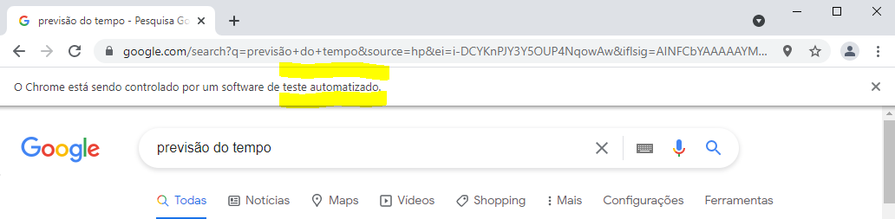

## Automação Web

### Descrição do Projeto
Aplicação de automação web simples em Python utilizando a biblioteca selenium. 
### 📑 Funcionalidades

- [x] Automação de busca pela previsão do tempo.

### 📌 Pré-requisitos

Antes de começar, você vai precisar ter instalado em sua máquina as seguintes ferramentas:
[Git](https://git-scm.com) e [Python](https://www.python.org/). 
Além disto é bom ter um editor para trabalhar com o código como [VSCode](https://code.visualstudio.com/) ou [PyCharm](https://www.jetbrains.com/pt-br/pycharm/download/).

#### Drivers para browsers:
[ChromeDriver](https://sites.google.com/a/chromium.org/chromedriver/downloads) no Google Chrome ou o [geckodriver](https://github.com/mozilla/geckodriver/releases) no Firefox. Após o download coloque o arquivo do driver na mesma pasta que está o executável python no seu computador. Para qualquer dúvida no processo recomendo esse [vídeo](https://www.youtube.com/watch?v=y7OhuSGBt8o).

####  Instalar a biblioteca Selenium:
```bash
$ pip install selenium
```
### Clonando do repositório
```bash
git clone https://github.com/llucasrafaell/web-automation
cd web-automation
```
#### Executando
```bash
python WebAutomation.py
```
### Demonstração de aplicação

<h4 align="center">   
	
<p align="center">
  
</p>
	
	☑️  Status do projeto: Finalizado ☑️
</h4>
